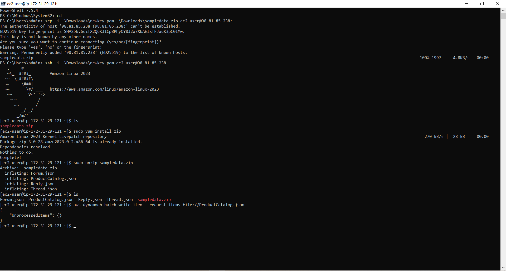
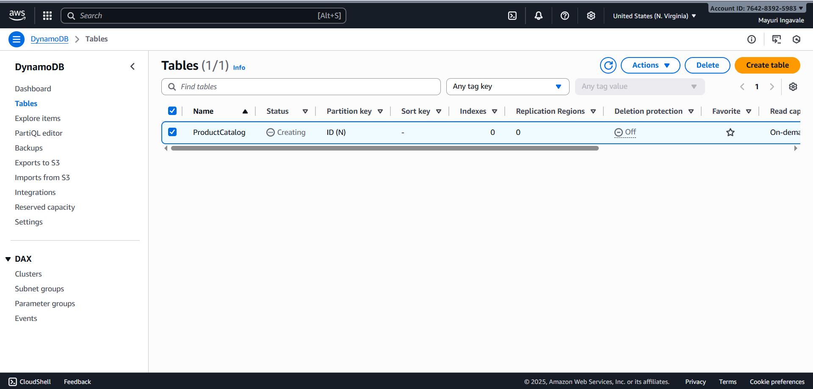

# Database-Migration

# Data Migration: EC2 File to DynamoDB:

This project demonstrates how to migrate data stored in files (CSV or JSON) on an **Amazon EC2** instance into an **Amazon DynamoDB** table using Python (Boto3) or Node.js (AWS SDK).

---

##  Overview:

Data migration from EC2 to DynamoDB helps move structured or semi-structured data (such as user data, logs, or inventory records) into a scalable NoSQL database for better performance and accessibility.

This project covers:
- Reading local files on EC2 (CSV or JSON)
- Transforming data into DynamoDB-compatible format
- Batch writing to DynamoDB efficiently
- Handling retries and throttling

---

 ##  Prerequisites:

Before starting, ensure the following setup is complete:

###  AWS Resources
- An **AWS account**
- An **EC2 instance** (Amazon Linux / Ubuntu preferred)
- A **DynamoDB table** with defined primary key(s)
- (Optional) **S3 bucket** for backup or staging

---
## Steps to Perform:
Step 1:- Create an EC2 Instance

---
Step 2:- Create an Iam role for Ec2 to access dynamodb and assign role to your instance

---
Step 3:- Login to your EC2 instance
- Install zip
- Unzip your file

---
Step 4:- Create table with its respective partition key in your dynamodb

---
Step 5:- Write the command
- This command is used to insert data from file into DynamoDB table

---
Step 6:- Check on Dynamodb
- Go to Dynamodb console ➜ Tables ➜Explore table items to check the inserted data

---
## Conclusion:
This project efficiently migrates data from EC2 file storage to DynamoDB, ensuring faster access, better scalability, and reliable cloud-based storage.  
It simplifies data handling, reduces manual effort, and makes the system ready for modern, serverless AWS workflows.

---

